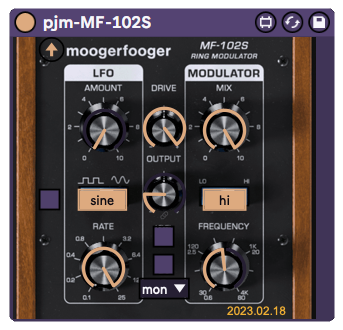
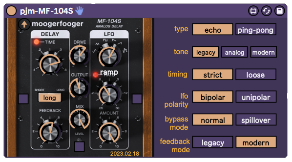

pjm-moogerfooger - Max for Live device wrappers for Moogerfooger plugins
--------------------------------------------------------------------------------

This is a Max for Live Audio Effect device. It is a wrapper over the [Moog
Moogerfooger plugins], which you must already have installed on your box.

The "skins" for the devices were created by screenshotting the devices on
my computer, and then placing them in the patcher window.  

Each device has a small "up arrow" control near the top left, that can
be used to open the actual plugin to interact with it.

I attempted to deal with presets, but ... it's a mess.  I think what I
finally found was that selecting a preset did not reflect the parameter
changes back to Max, so ... it *would* change the device settings, but
then the device settings no longer matched the view in Live.

[Moog Moogerfooger plugins]: https://www.moogmusic.com/products/moogerfooger-effects-plug-ins

usage
================================================================================

Download the [latest version](https://github.com/pmuellr/pjm-moogerfooger/archive/refs/heads/main.zip).

Extract the contents of the archive, and drag the `*.amxd` files to your 
User Library.  Or whatever it is you do with your `*.amxd` files.

details
================================================================================

--------------------------------------------------------------------------------

pjm-MF-101S Filter
--------------------------------------------------------------------------------

The Link Gains, Envelope Type, and Envelope Response controls are the
toggle buttons under the Output knob.

VST parameter number, parameter names, with associated Moog name:

| param  | pjm name | Moog name |
| ------ | -------- | --------- |
|    2   | drive    | Drive |
|    3   | output   | Output Level |
|    4   | link     | Link Gains |
|    5   | env      | Envelope Amount |
|    6   | follow   | Follow Rate |
|    7   | mix      | Mix |
|    8   | cutoff   | Cutoff |
|    9   | slope    | Slope |
|   10   | res      | Resonance |
|   11   | type     | Envelope Type |
|   12   | resp     | Envelope Response |

Auto-mapped parameters as the following banks:

| control 1   | control 2     | control 3    | control 4   | control 5     | control 6   | control 7     | control 8  |   
|-------------|---------------|--------------|-------------|---------------|-------------|---------------|-------------
| env         | follow        | mix          | slope       | drive         | output      | cutoff        | res        |
| link        | type          | resp         | slope       |               |             |               |            |

--------------------------------------------------------------------------------

pjm-MF-102S Ring Modulator
--------------------------------------------------------------------------------

The LFO Sync control is the toggle to the left of the LFO Waveform
button. The Link Gains and LFO Polarity controls are the toggles beneath
the Output knob.  The Carrier Type control is the menu below the LFO
Polarity toggle.

VST parameter number, parameter names, with associated Moog name:

| param  | pjm name | Moog name |
| ------ | -------- | --------- |
|      2 | drive    | Drive |
|      3 | output   | Output Level |
|      4 | link     | Link Gains |
|      5 | lfo      | LFO Amount |
|      6 | waveform | LFO Waveform |
|      7 | rate     | LFO Rate |
|      8 | sync     | LFO Sync |
|      9 | mix      | Mix |
|     10 | range    | Frequency Range |
|     11 | freq     | Frequency |
|     12 | carrier  | Carrier Type |
|     13 | polarity | LFO Polarity |

Auto-mapped parameters as the following banks:

| control 1   | control 2     | control 3    | control 4   | control 5     | control 6   | control 7     | control 8  |   
|-------------|---------------|--------------|-------------|---------------|-------------|---------------|-------------
| lfo         | waveform      | rate         | drive       | output        | mix         | range         | freq       |

--------------------------------------------------------------------------------

pjm-MF-103S 12-Stage Phaser
--------------------------------------------------------------------------------

The LFO Sync control is the toggle to the left of the LFO Range
button. The Link Gains and LFO Type controls are the toggles beneath
the Output knob.  The Output Mode control is the menu below the LFO
Type toggle.

VST parameter number, parameter names, with associated Moog name:

| param  | pjm name | Moog name |
| ------ | -------- | --------- |
|      2 | drive    | Drive |
|      3 | output   | Output Level |
|      4 | link     | Link Gains |
|      5 | lfo      | LFO Amount |
|      6 | range    | LFO Range |
|      7 | rate     | LFO Rate |
|      8 | sync     | LFO Sync |
|      9 | sweep    | Sweep |
|     10 | stages   | Stages |
|     11 | res      | Resonance |
|     12 | mode     | Output Mode |
|     13 | type     | LFO Type |

Auto-mapped parameters as the following banks:

| control 1   | control 2     | control 3    | control 4   | control 5     | control 6   | control 7     | control 8  |   
|-------------|---------------|--------------|-------------|---------------|-------------|---------------|-------------
| lfo         | range         | rate         | sync        | drive         | output      | sweep         | res        |
| stages      | link          | mode         | type        |               |             |               |            |

pjm-MF-104S Analog Delay
--------------------------------------------------------------------------------

The Time Sync control is the toggle to the left of the Delay Range
switch (short/long). The LFO Sync control is the toggle to the right of
the LFO Rate knob. The Link Gains control is the toggle beneath
the Mix knob.

VST parameter number, parameter names, with associated Moog name:

| param  | pjm name      | Moog name |
| ------ | ------------- | --------- |
|      2 | drive         |  Drive              
|      3 | output        |  Output Level                     
|      4 | link          |  Link Gains                   
|      5 | mix           |  Mix            
|      6 | time          |  Time             
|      7 | range         |  Range              
|      8 | feedback      |  Feedback                 
|      9 | delaySync     |  Delay Sync                   
|     10 | lfoWaveform   |  LFO Waveform                     
|     11 | lfoRate       |  LFO Rate                 
|     12 | lfoAmount     |  LFO Amount                   
|     13 | lfoSync       |  LFO Sync                 
|     14 | delayType     |  Delay Type                   
|     15 | tone          |  Tone             
|     16 | timing        |  Timing               
|     17 | lfoPolarity   |  LFO Polarity                     
|     18 | bypassMode    |  Bypass Mode                    
|     19 | feedbackMode  |  Feedback Mode                      

Auto-mapped parameters as the following banks:

| control 1   | control 2     | control 3    | control 4   | control 5     | control 6   | control 7     | control 8  |   
|-------------|---------------|--------------|-------------|---------------|-------------|---------------|-------------
| time        | feedback      | lfoWaveform  | lfoRate     | lfoAmount     | drive       | output        | mix        |

--------------------------------------------------------------------------------

changelog
================================================================================

version 2023.02.18

- finished MF-104S
- touch ups for MF-102S, MF-103S

version 2023.02.17

- finished MF-103S
- plugin names changed, or `vst~` changed; plugin names updated so they load
- added version labels to the plugins; will I remember to update? :-)

version 2022.12.03

- finished MF-101S and MF-102S

version 2022.11.30

- initial version